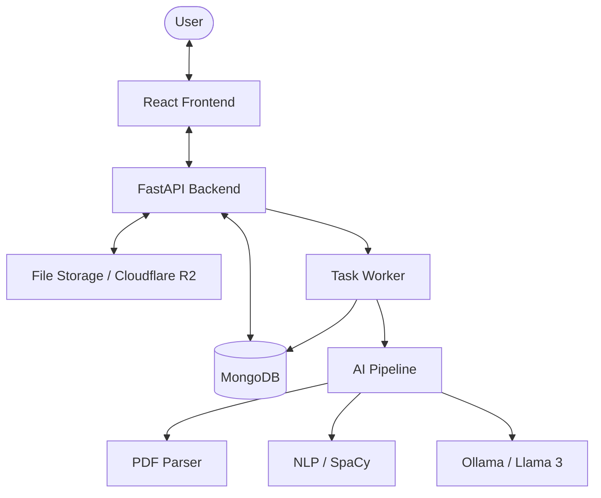

# 🚀 AI Resume Analyzer

[](https://opensource.org/licenses/MIT)
[](https://fastapi.tiangolo.com/)
[](https://reactjs.org/)
[](https://tailwindcss.com/)
[](https://ollama.com/)

An enterprise-grade, AI-powered platform designed to streamline the recruitment process. It intelligently parses resumes, extracts key skills using natural language processing, and provides a comprehensive score against job descriptions using state-of-the-art Large Language Models (LLMs).

---

## ✨ Key Features

- **🧠 Advanced AI Parsing**: Multi-stage extraction using `pdfplumber` and `PyPDF2` combined with NLP heuristics for high-fidelity text recovery.
- **🎯 Semantic Scoring**: Goes beyond keyword matching. Leverages `sentence-transformers` and `FAISS` for semantic similarity analysis between resumes and job descriptions.
- **🤖 LLM Integration**: Powered by **Ollama (Llama 3)** for deep contextual analysis, skill identification, and actionable feedback.
- **⚡ Asynchronous Processing**: Robust background worker architecture ensures a responsive user experience while processing heavy PDF files.
- **🛡️ Enterprise Security**: JWT-based authentication, secure file handling, and environment-driven configurations.
- **📦 Scalable Storage**: Flexible storage options including local filesystem and **Cloudflare R2** (S3-compatible).

---

## 🏗️ System Architecture



---

## 🛠️ Tech Stack

### Frontend
- **Framework**: [React 19](https://react.dev/) (Vite)
- **Styling**: [Tailwind CSS 4](https://tailwindcss.com/) & [Framer Motion](https://www.framer.com/motion/)
- **State Management**: [Redux Toolkit](https://redux-toolkit.js.org/)
- **Icons**: [Lucide React](https://lucide.dev/)

### Backend
- **Web Framework**: [FastAPI](https://fastapi.tiangolo.com/)
- **Database**: [MongoDB](https://www.mongodb.com/) (Motor driver)
- **Background Tasks**: [Celery/Python Workers](https://docs.celeryq.dev/)

### AI & Machine Learning
- **LLM Engine**: [Ollama](https://ollama.com/) (Llama 3)
- **NLP**: [spaCy](https://spacy.io/)
- **Embeddings**: [Sentence Transformers](https://www.sbert.net/) & [FAISS](https://github.com/facebookresearch/faiss)

---

## 🚀 Getting Started

### Prerequisites
- Python 3.9+
- Node.js 20+
- MongoDB
- [Ollama](https://ollama.com/) (installed and running `llama3`)

### 1. Project Setup
```bash
git clone https://github.com/your-username/AI_RESUME_ANALYZER.git
cd AI_RESUME_ANALYZER
```

### 2. Backend Installation
```bash
python -m venv .venv
# On Windows:
.venv\Scripts\activate
# On macOS/Linux:
source .venv/bin/activate

pip install -r requirements.txt
cp .env.example .env
```
*Configure your `.env` file with appropriate credentials.*

### 3. Frontend Installation
```bash
cd frontend
npm install
```

### 4. Running the Application
**Start Backend:**
```bash
uvicorn backend.app.main:app --reload
```
**Start Worker (in separate terminal):**
```bash
python -m workers.tasks
```
**Start Frontend (in separate terminal):**
```bash
npm run dev
```

---

## 📄 API Documentation

The API documentation is automatically generated by Swagger and can be accessed at:
- **Swagger UI**: `http://localhost:8000/docs`
- **ReDoc**: `http://localhost:8000/redoc`

### Core Endpoints
- `POST /api/v1/resumes/upload`: Upload and initiate resume parsing.
- `GET /api/v1/analysis/{id}`: Retrieve detailed analysis results.
- `POST /api/v1/auth/login`: Authenticate users and retrieve JWT tokens.

---

## 📂 Project Structure

```text
AI_RESUME_ANALYZER/
├── ai/                 # AI & NLP Processing Logic
├── backend/            # FastAPI Application & Routes
├── frontend/           # React Frontend (Vite)
├── workers/            # Background Task Workers
├── storage/            # Local File Storage Fallback
├── docs/               # System Documentation
└── .env.example        # Environment Variable Template
```

---

## 🤝 Contributing

Contributions are welcome! Please follow these steps:
1. Fork the Project.
2. Create your Feature Branch (`git checkout -b feature/AmazingFeature`).
3. Commit your Changes (`git commit -m 'Add some AmazingFeature'`).
4. Push to the Branch (`git push origin feature/AmazingFeature`).
5. Open a Pull Request.

---

## ⚖️ License

Distributed under the MIT License. See `LICENSE` for more information.

---

## ⭐ Acknowledgments

- [Ollama Team](https://ollama.com/) for the amazing LLM runtime.
- [FastAPI](https://fastapi.tiangolo.com/) for the high-performance web framework.
- The open-source AI community for the models and libraries.

